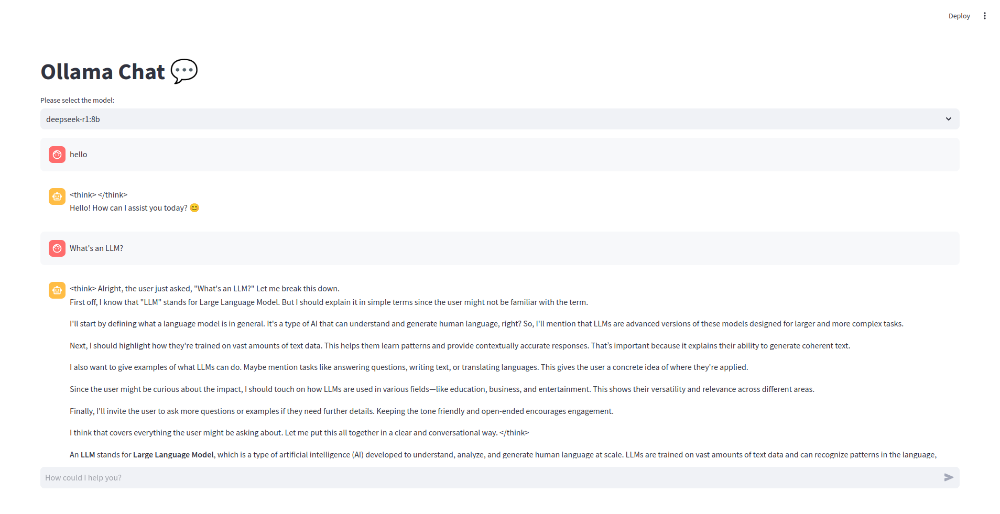

# OllamaUI

A simple Streamlit UI for interacting with LLMs via Ollama.



## Dependencies and requirements

- [Streamlit](https://streamlit.io/)
- [Ollama](https://ollama.com/)

You need to have Ollama installed in your environment and ready to use. You can find the instructions [here](https://ollama.com/download).
You also need to pull a model from their offerings. You can find the instructions [here](https://ollama.com/search).

## Installation

1. Clone the repository
2. Create a virtual environment
3. Install the dependencies

    ```bash
    pip install -r requirements.txt
    ```

## Usage

```bash
streamlit run main.py
```
